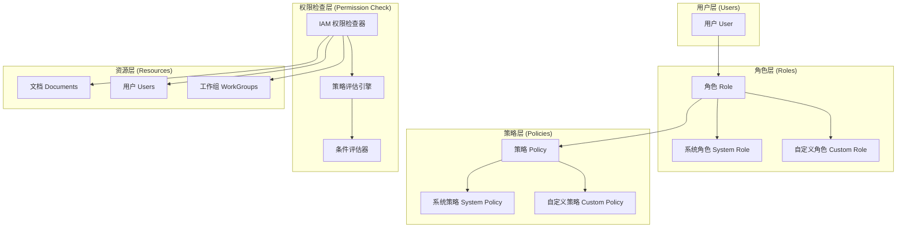
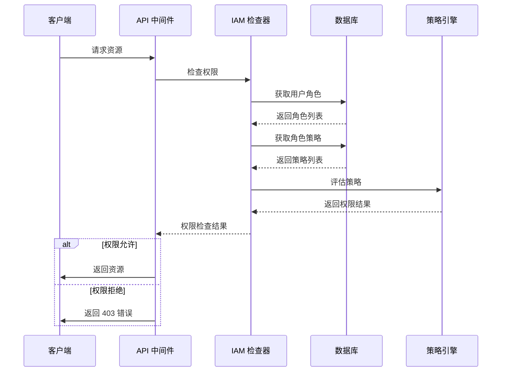
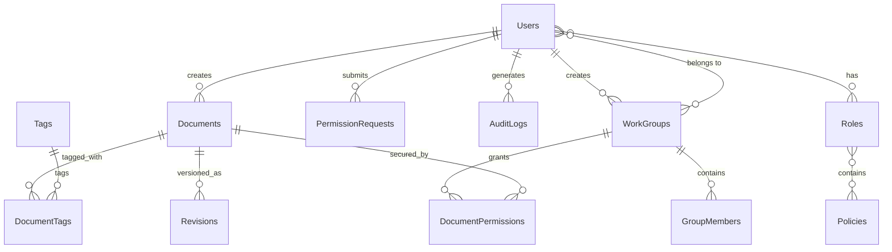
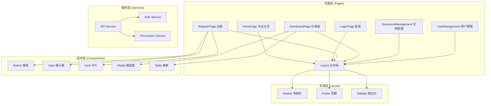
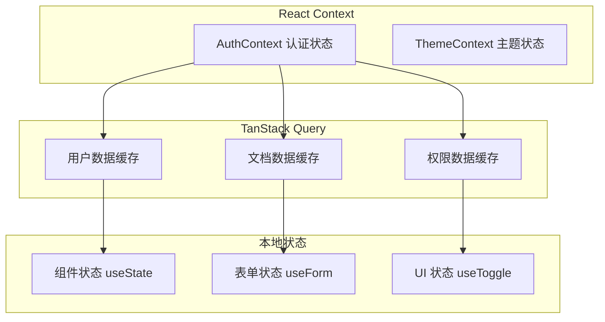
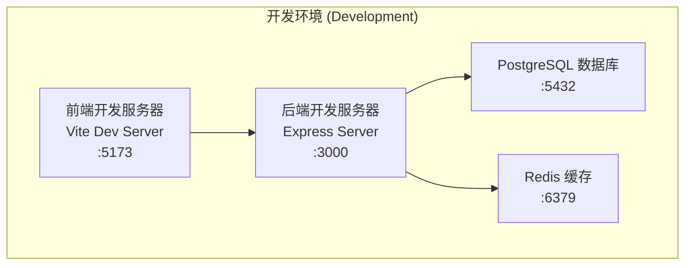
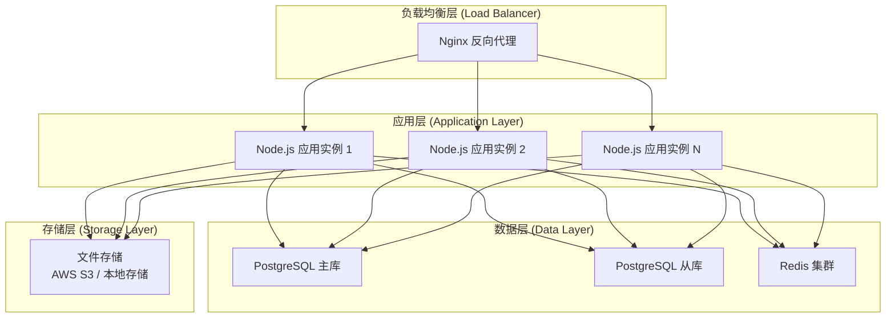
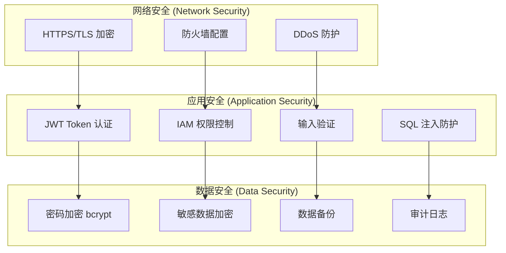
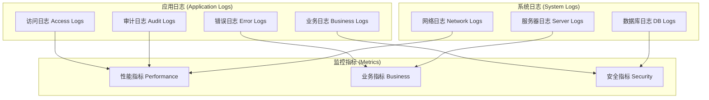

# 🏗️ 知识库系统架构设计 v2.0

**项目名称**：知识库软件（Knowledge Base System）  
**版本**：v2.0  
**日期**：2025-10-02  
**作者**：Xiaohua Zhu  
**技术栈**：Node.js + Express + PostgreSQL + React + Vite

---

## 📋 目录

1. [系统总体架构](#1-系统总体架构)
2. [技术栈选型](#2-技术栈选型)
3. [模块划分](#3-模块划分)
4. [IAM 权限系统架构](#4-iam-权限系统架构)
5. [数据库架构](#5-数据库架构)
6. [前端架构](#6-前端架构)
7. [API 架构](#7-api-架构)
8. [部署架构](#8-部署架构)
9. [安全架构](#9-安全架构)
10. [监控与日志](#10-监控与日志)

---

## 1. 系统总体架构

知识库软件采用 **前后端分离架构**，基于 **AWS IAM 权限模型**，支持工作组协作和细粒度权限控制。

```mermaid
graph TB
    subgraph "前端层 (Frontend)"
        A[React + Vite 应用]
        B[TailwindCSS 样式]
        C[React Router 路由]
        D[TanStack Query 状态管理]
    end
    
    subgraph "API 网关层 (API Gateway)"
        E[Express.js 服务器]
        F[CORS 中间件]
        G[Helmet 安全中间件]
        H[Rate Limiting]
    end
    
    subgraph "业务逻辑层 (Business Logic)"
        I[认证服务]
        J[文档管理服务]
        K[用户管理服务]
        L[权限管理服务]
        M[工作组协作服务]
        N[搜索服务]
    end
    
    subgraph "数据访问层 (Data Access)"
        O[Sequelize ORM]
        P[PostgreSQL 数据库]
        Q[Redis 缓存 (可选)]
    end
    
    subgraph "外部服务 (External Services)"
        R[NLP 服务 (预留)]
        S[文件存储 (预留)]
        T[邮件服务 (预留)]
    end
    
    A --> E
    B --> A
    C --> A
    D --> A
    
    E --> F
    F --> G
    G --> H
    H --> I
    
    I --> J
    J --> K
    K --> L
    L --> M
    M --> N
    
    I --> O
    J --> O
    K --> O
    L --> O
    M --> O
    N --> O
    
    O --> P
    O --> Q
    
    N --> R
    J --> S
    I --> T
```

---

## 2. 技术栈选型

### 2.1 后端技术栈

| 组件 | 技术选型 | 版本 | 说明 |
|------|----------|------|------|
| **运行时** | Node.js | ≥18.0 | JavaScript 运行时 |
| **框架** | Express.js | 4.x | Web 应用框架 |
| **ORM** | Sequelize | 6.x | PostgreSQL ORM |
| **数据库** | PostgreSQL | ≥14 | 关系型数据库 |
| **认证** | JWT | - | JSON Web Token |
| **密码加密** | bcryptjs | - | 密码哈希 |
| **验证** | Sequelize Validators | - | 数据验证 |
| **日志** | Winston | - | 日志管理 |

### 2.2 前端技术栈

| 组件 | 技术选型 | 版本 | 说明 |
|------|----------|------|------|
| **框架** | React | 19.x | UI 框架 |
| **构建工具** | Vite | 7.x | 构建工具 |
| **样式** | TailwindCSS | 3.x | CSS 框架 |
| **路由** | React Router | 6.x | 客户端路由 |
| **状态管理** | TanStack Query | 5.x | 服务器状态管理 |
| **HTTP 客户端** | Axios | 1.x | HTTP 请求库 |
| **图标** | Lucide React | - | 图标库 |
| **类型检查** | TypeScript | 5.x | 类型系统 |

### 2.3 开发工具

| 工具 | 用途 | 说明 |
|------|------|------|
| **ESLint** | 代码检查 | JavaScript/TypeScript 代码质量 |
| **Prettier** | 代码格式化 | 统一代码风格 |
| **PostCSS** | CSS 处理 | TailwindCSS 处理 |
| **Git** | 版本控制 | 代码版本管理 |

---

## 3. 模块划分

### 3.1 后端模块架构

```
src/backend/
├── config/           # 配置文件
│   ├── database.js   # 数据库配置
│   └── env.js        # 环境变量配置
├── controllers/      # 控制器层
│   ├── authController.js
│   ├── docsController.js
│   ├── userController.js
│   ├── roleController.js
│   ├── policyController.js
│   └── ...
├── middleware/       # 中间件层
│   ├── auth.js       # JWT 认证中间件
│   ├── iam.js        # IAM 权限中间件
│   ├── validation.js # 数据验证中间件
│   └── ...
├── models/          # 数据模型层
│   ├── User.js
│   ├── Document.js
│   ├── Role.js
│   ├── Policy.js
│   └── ...
├── routes/          # 路由层
│   ├── auth.js
│   ├── docs.js
│   ├── users.js
│   ├── roles.js
│   ├── policies.js
│   └── ...
├── services/        # 业务逻辑层
│   ├── authService.js
│   ├── docService.js
│   └── ...
└── utils/          # 工具函数
    ├── logger.js
    ├── crypto.js
    └── ...
```

### 3.2 前端模块架构

```
src/frontend/src/
├── components/      # 可复用组件
│   ├── UI/         # 基础 UI 组件
│   ├── Layout/     # 布局组件
│   ├── Forms/      # 表单组件
│   └── ...
├── pages/          # 页面组件
│   ├── Home.tsx
│   ├── Login.tsx
│   ├── Dashboard.tsx
│   ├── DocumentManagement.tsx
│   └── ...
├── contexts/      # React Context
│   ├── AuthContext.tsx
│   └── ...
├── hooks/         # 自定义 Hooks
│   ├── useAuth.ts
│   ├── useDocuments.ts
│   └── ...
├── services/      # API 服务
│   ├── api.js
│   └── ...
├── utils/         # 工具函数
│   ├── permissions.ts
│   ├── formatters.ts
│   └── ...
└── types/        # TypeScript 类型定义
    ├── index.ts
    └── ...
```

---

## 4. IAM 权限系统架构

### 4.1 IAM 模型设计



### 4.2 权限检查流程



### 4.3 策略示例

```json
{
  "Version": "2025-10-02",
  "Statement": [
    {
      "Effect": "Allow",
      "Action": ["docs:Create", "docs:Read", "docs:Update", "docs:Delete"],
      "Resource": ["doc:${user.id}/*"],
      "Condition": {
        "StringEquals": {
          "docs:author_id": "${user.id}"
        }
      }
    },
    {
      "Effect": "Deny",
      "Action": ["docs:Delete"],
      "Resource": ["doc:sensitive/*"]
    }
  ]
}
```

---

## 5. 数据库架构

### 5.1 数据库设计原则

- **规范化设计**：遵循第三范式，减少数据冗余
- **性能优化**：合理使用索引，支持高并发查询
- **扩展性**：支持水平扩展和分片
- **一致性**：使用事务保证数据一致性

### 5.2 核心表关系



### 5.3 索引策略

```sql
-- 用户表索引
CREATE INDEX idx_users_email ON users(email);
CREATE INDEX idx_users_username ON users(username);
CREATE INDEX idx_users_active ON users(is_active);

-- 文档表索引
CREATE INDEX idx_documents_author ON documents(author_id);
CREATE INDEX idx_documents_category ON documents(category);
CREATE INDEX idx_documents_status ON documents(status);
CREATE INDEX idx_documents_fulltext ON documents USING gin(to_tsvector('english', title || ' ' || content));

-- 权限表索引
CREATE INDEX idx_user_roles_user ON user_roles(user_id);
CREATE INDEX idx_user_roles_active ON user_roles(user_id, role_id) WHERE expires_at IS NULL OR expires_at > CURRENT_TIMESTAMP;
```

---

## 6. 前端架构

### 6.1 组件架构



### 6.2 状态管理架构



### 6.3 主页功能架构

主页 (`HomePage.tsx`) 是系统的入口页面，提供专业的产品展示和用户引导：

#### 6.3.1 功能特性
- **产品展示**：Hero区域展示核心价值主张
- **功能亮点**：6个核心功能模块展示
- **统计数据**：系统使用情况统计
- **优势介绍**：4个关键优势点
- **智能导航**：根据用户登录状态显示不同按钮
- **响应式设计**：适配桌面和移动设备

#### 6.3.2 技术实现
- **组件结构**：单一组件，包含多个功能区域
- **状态管理**：使用 `useAuth` Hook 获取认证状态
- **路由集成**：作为根路径 (`/`) 的默认页面
- **样式系统**：TailwindCSS 实现现代化设计

#### 6.3.3 用户体验
- **未登录用户**：显示注册和登录按钮，引导用户注册
- **已登录用户**：显示欢迎信息和仪表板入口
- **视觉设计**：渐变背景、卡片布局、图标设计
- **交互反馈**：悬停效果、按钮状态变化

---

## 7. API 架构

### 7.1 RESTful API 设计

```mermaid
graph TB
    subgraph "认证层 (Authentication)"
        A[JWT Token 验证]
        B[权限中间件]
    end
    
    subgraph "路由层 (Routes)"
        C[/api/auth/* 认证路由]
        D[/api/docs/* 文档路由]
        E[/api/users/* 用户路由]
        F[/api/roles/* 角色路由]
        G[/api/policies/* 策略路由]
        H[/api/work-groups/* 工作组路由]
    end
    
    subgraph "控制器层 (Controllers)"
        I[AuthController]
        J[DocsController]
        K[UserController]
        L[RoleController]
        M[PolicyController]
        N[WorkGroupController]
    end
    
    subgraph "服务层 (Services)"
        O[AuthService]
        P[DocService]
        Q[UserService]
        R[PermissionService]
    end
    
    A --> C
    B --> D
    B --> E
    B --> F
    B --> G
    B --> H
    
    C --> I
    D --> J
    E --> K
    F --> L
    G --> M
    H --> N
    
    I --> O
    J --> P
    K --> Q
    L --> R
    M --> R
    N --> R
```

### 7.2 API 版本控制

- **URL 版本控制**：`/api/v1/`, `/api/v2/`
- **向后兼容**：保持旧版本 API 可用
- **渐进式升级**：逐步迁移到新版本

### 7.3 错误处理架构

```javascript
// 统一错误处理中间件
app.use((err, req, res, next) => {
  const errorResponse = {
    error: {
      code: err.code || 'INTERNAL_ERROR',
      message: err.message || 'Internal Server Error',
      details: err.details || null,
      timestamp: new Date().toISOString(),
      path: req.path,
      method: req.method
    }
  };
  
  res.status(err.status || 500).json(errorResponse);
});
```

---

## 8. 部署架构

### 8.1 开发环境



### 8.2 生产环境



### 8.3 Docker 容器化

```dockerfile
# 前端 Dockerfile
FROM node:18-alpine AS frontend-build
WORKDIR /app
COPY package*.json ./
RUN npm ci
COPY . .
RUN npm run build

FROM nginx:alpine
COPY --from=frontend-build /app/dist /usr/share/nginx/html
COPY nginx.conf /etc/nginx/nginx.conf

# 后端 Dockerfile
FROM node:18-alpine
WORKDIR /app
COPY package*.json ./
RUN npm ci --only=production
COPY . .
EXPOSE 3000
CMD ["node", "src/backend/server.js"]
```

---

## 9. 安全架构

### 9.1 安全层次



### 9.2 安全中间件

```javascript
// 安全中间件配置
app.use(helmet({
  contentSecurityPolicy: {
    directives: {
      defaultSrc: ["'self'"],
      styleSrc: ["'self'", "'unsafe-inline'"],
      scriptSrc: ["'self'"],
      imgSrc: ["'self'", "data:", "https:"],
    },
  },
}));

app.use(cors({
  origin: process.env.FRONTEND_URL || 'http://localhost:5173',
  credentials: true
}));

app.use(rateLimit({
  windowMs: 15 * 60 * 1000, // 15 minutes
  max: 100 // limit each IP to 100 requests per windowMs
}));
```

---

## 10. 监控与日志

### 10.1 日志架构



### 10.2 监控指标

- **性能指标**：响应时间、吞吐量、错误率
- **业务指标**：用户活跃度、文档创建量、搜索频率
- **安全指标**：登录失败次数、权限拒绝次数、异常访问

---

## 📚 相关文档

- [PRD v2.0](./PRD-v2.md) - 产品需求文档
- [API 规范 v2.0](./api-spec-v2.md) - API 接口规范
- [数据库设计 v2.0](./db-schema-v2.md) - 数据库设计文档
- [部署指南](./deployment.md) - 部署和运维指南

---

✅ **说明**：本架构文档 v2.0 基于已实施的 IAM 权限系统，反映了当前系统的实际技术架构和设计原则。
