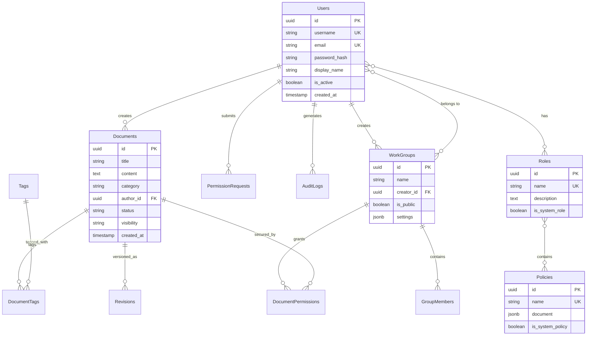

# 🗄️ 知识库系统数据库设计 v2.0

**项目名称**：知识库软件（Knowledge Base System）  
**版本**：v2.0  
**日期**：2025-10-02  
**作者**：Xiaohua Zhu  
**数据库**：PostgreSQL 14+

---

## 📋 目录

1. [概述](#1-概述)
2. [核心表结构](#2-核心表结构)
3. [IAM 权限模型](#3-iam-权限模型)
4. [改进的权限系统](#4-改进的权限系统)
5. [关系图](#5-关系图)
6. [索引优化](#6-索引优化)
7. [示例数据](#7-示例数据)
8. [迁移指南](#8-迁移指南)

---

## 1. 概述

本数据库设计基于 **AWS IAM 权限模型**，实现了灵活、可扩展的权限管理系统。支持：

- ✅ **细粒度权限控制**：资源级别的权限管理
- ✅ **动态权限策略**：JSONB 存储的 IAM 风格策略
- ✅ **工作组协作**：支持团队协作和文档共享
- ✅ **权限申请系统**：用户可自主申请权限
- ✅ **审计日志**：完整的操作记录

---

## 2. 核心表结构

### 2.1 用户表（Users）

```sql
CREATE TABLE users (
    id UUID PRIMARY KEY DEFAULT gen_random_uuid(),
    username VARCHAR(50) UNIQUE NOT NULL,
    email VARCHAR(255) UNIQUE NOT NULL,
    password_hash VARCHAR(255) NOT NULL,
    display_name VARCHAR(100),
    avatar_url VARCHAR(500),
    is_active BOOLEAN DEFAULT true,
    email_verified BOOLEAN DEFAULT false,
    last_login_at TIMESTAMP,
    created_at TIMESTAMP DEFAULT CURRENT_TIMESTAMP,
    updated_at TIMESTAMP DEFAULT CURRENT_TIMESTAMP
);

-- 索引
CREATE INDEX idx_users_email ON users(email);
CREATE INDEX idx_users_username ON users(username);
CREATE INDEX idx_users_active ON users(is_active);
CREATE INDEX idx_users_created_at ON users(created_at);
```

### 2.2 文档表（Documents）

```sql
CREATE TABLE documents (
    id UUID PRIMARY KEY DEFAULT gen_random_uuid(),
    title VARCHAR(200) NOT NULL,
    content TEXT NOT NULL,
    summary TEXT,
    category VARCHAR(50) NOT NULL CHECK (category IN ('prd', 'architecture', 'api', 'db', 'code', 'dependency')),
    doc_type VARCHAR(20) DEFAULT 'General' CHECK (doc_type IN ('SOP', 'Review', 'Research', 'General')),
    author_id UUID NOT NULL REFERENCES users(id) ON DELETE CASCADE,
    status VARCHAR(20) DEFAULT 'draft' CHECK (status IN ('draft', 'published', 'archived')),
    visibility VARCHAR(20) DEFAULT 'private' CHECK (visibility IN ('private', 'group', 'public')),
    version INTEGER DEFAULT 1,
    published_at TIMESTAMP,
    archived_at TIMESTAMP,
    created_at TIMESTAMP DEFAULT CURRENT_TIMESTAMP,
    updated_at TIMESTAMP DEFAULT CURRENT_TIMESTAMP
);

-- 索引
CREATE INDEX idx_documents_author ON documents(author_id);
CREATE INDEX idx_documents_category ON documents(category);
CREATE INDEX idx_documents_status ON documents(status);
CREATE INDEX idx_documents_visibility ON documents(visibility);
CREATE INDEX idx_documents_created_at ON documents(created_at);
CREATE INDEX idx_documents_title_content ON documents USING gin(to_tsvector('english', title || ' ' || content));
```

### 2.3 标签表（Tags）

```sql
CREATE TABLE tags (
    id UUID PRIMARY KEY DEFAULT gen_random_uuid(),
    name VARCHAR(50) UNIQUE NOT NULL,
    description TEXT,
    color VARCHAR(7) DEFAULT '#3B82F6', -- Hex color
    created_by UUID REFERENCES users(id),
    created_at TIMESTAMP DEFAULT CURRENT_TIMESTAMP
);

-- 索引
CREATE INDEX idx_tags_name ON tags(name);
```

### 2.4 文档标签关联表（DocumentTags）

```sql
CREATE TABLE document_tags (
    document_id UUID REFERENCES documents(id) ON DELETE CASCADE,
    tag_id UUID REFERENCES tags(id) ON DELETE CASCADE,
    created_at TIMESTAMP DEFAULT CURRENT_TIMESTAMP,
    PRIMARY KEY (document_id, tag_id)
);

-- 索引
CREATE INDEX idx_document_tags_document ON document_tags(document_id);
CREATE INDEX idx_document_tags_tag ON document_tags(tag_id);
```

### 2.5 版本记录表（Revisions）

```sql
CREATE TABLE revisions (
    id UUID PRIMARY KEY DEFAULT gen_random_uuid(),
    document_id UUID NOT NULL REFERENCES documents(id) ON DELETE CASCADE,
    version INTEGER NOT NULL,
    title VARCHAR(200),
    content TEXT,
    summary TEXT,
    change_summary TEXT,
    updated_by UUID NOT NULL REFERENCES users(id),
    created_at TIMESTAMP DEFAULT CURRENT_TIMESTAMP
);

-- 索引
CREATE INDEX idx_revisions_document ON revisions(document_id);
CREATE INDEX idx_revisions_version ON revisions(document_id, version);
CREATE INDEX idx_revisions_updated_by ON revisions(updated_by);
CREATE INDEX idx_revisions_created_at ON revisions(created_at);
```

---

## 3. IAM 权限模型

### 3.1 角色表（Roles）

```sql
CREATE TABLE roles (
    id UUID PRIMARY KEY DEFAULT gen_random_uuid(),
    name VARCHAR(50) UNIQUE NOT NULL,
    description TEXT,
    is_system_role BOOLEAN DEFAULT false,
    created_at TIMESTAMP DEFAULT CURRENT_TIMESTAMP,
    updated_at TIMESTAMP DEFAULT CURRENT_TIMESTAMP
);

-- 索引
CREATE INDEX idx_roles_name ON roles(name);
CREATE INDEX idx_roles_system ON roles(is_system_role);
```

### 3.2 策略表（Policies）

```sql
CREATE TABLE policies (
    id UUID PRIMARY KEY DEFAULT gen_random_uuid(),
    name VARCHAR(100) UNIQUE NOT NULL,
    description TEXT,
    document JSONB NOT NULL,
    is_system_policy BOOLEAN DEFAULT false,
    created_at TIMESTAMP DEFAULT CURRENT_TIMESTAMP,
    updated_at TIMESTAMP DEFAULT CURRENT_TIMESTAMP
);

-- 索引
CREATE INDEX idx_policies_name ON policies(name);
CREATE INDEX idx_policies_system ON policies(is_system_policy);
CREATE INDEX idx_policies_document ON policies USING gin(document);
```

### 3.3 用户角色关联表（UserRoles）

```sql
CREATE TABLE user_roles (
    user_id UUID REFERENCES users(id) ON DELETE CASCADE,
    role_id UUID REFERENCES roles(id) ON DELETE CASCADE,
    assigned_by UUID REFERENCES users(id),
    assigned_at TIMESTAMP DEFAULT CURRENT_TIMESTAMP,
    expires_at TIMESTAMP,
    PRIMARY KEY (user_id, role_id)
);

-- 索引
CREATE INDEX idx_user_roles_user ON user_roles(user_id);
CREATE INDEX idx_user_roles_role ON user_roles(role_id);
CREATE INDEX idx_user_roles_assigned_by ON user_roles(assigned_by);
CREATE INDEX idx_user_roles_expires_at ON user_roles(expires_at);
```

### 3.4 角色策略关联表（RolePolicies）

```sql
CREATE TABLE role_policies (
    role_id UUID REFERENCES roles(id) ON DELETE CASCADE,
    policy_id UUID REFERENCES policies(id) ON DELETE CASCADE,
    assigned_at TIMESTAMP DEFAULT CURRENT_TIMESTAMP,
    PRIMARY KEY (role_id, policy_id)
);

-- 索引
CREATE INDEX idx_role_policies_role ON role_policies(role_id);
CREATE INDEX idx_role_policies_policy ON role_policies(policy_id);
```

---

## 4. 改进的权限系统

### 4.1 工作组表（WorkGroups）

```sql
CREATE TABLE work_groups (
    id UUID PRIMARY KEY DEFAULT gen_random_uuid(),
    name VARCHAR(100) NOT NULL,
    description TEXT,
    creator_id UUID NOT NULL REFERENCES users(id),
    is_public BOOLEAN DEFAULT false,
    settings JSONB DEFAULT '{"allowMemberInvite": true, "requireApproval": true, "defaultPermission": "reader"}',
    created_at TIMESTAMP DEFAULT CURRENT_TIMESTAMP,
    updated_at TIMESTAMP DEFAULT CURRENT_TIMESTAMP
);

-- 索引
CREATE INDEX idx_work_groups_creator ON work_groups(creator_id);
CREATE INDEX idx_work_groups_public ON work_groups(is_public);
CREATE INDEX idx_work_groups_name ON work_groups(name);
```

### 4.2 工作组成员表（GroupMembers）

```sql
CREATE TABLE group_members (
    id UUID PRIMARY KEY DEFAULT gen_random_uuid(),
    group_id UUID NOT NULL REFERENCES work_groups(id) ON DELETE CASCADE,
    user_id UUID NOT NULL REFERENCES users(id) ON DELETE CASCADE,
    role VARCHAR(20) DEFAULT 'member' CHECK (role IN ('leader', 'editor', 'member')),
    status VARCHAR(20) DEFAULT 'pending' CHECK (status IN ('active', 'pending', 'rejected')),
    joined_at TIMESTAMP,
    invited_by UUID REFERENCES users(id),
    created_at TIMESTAMP DEFAULT CURRENT_TIMESTAMP,
    UNIQUE(group_id, user_id)
);

-- 索引
CREATE INDEX idx_group_members_group ON group_members(group_id);
CREATE INDEX idx_group_members_user ON group_members(user_id);
CREATE INDEX idx_group_members_status ON group_members(status);
CREATE INDEX idx_group_members_role ON group_members(role);
```

### 4.3 权限申请表（PermissionRequests）

```sql
CREATE TABLE permission_requests (
    id UUID PRIMARY KEY DEFAULT gen_random_uuid(),
    user_id UUID NOT NULL REFERENCES users(id),
    request_type VARCHAR(50) NOT NULL CHECK (request_type IN ('join_group', 'role_upgrade', 'special_permission', 'document_access')),
    target_id UUID,
    target_type VARCHAR(50),
    reason TEXT,
    status VARCHAR(20) DEFAULT 'pending' CHECK (status IN ('pending', 'approved', 'rejected')),
    reviewed_by UUID REFERENCES users(id),
    reviewed_at TIMESTAMP,
    review_notes TEXT,
    metadata JSONB,
    created_at TIMESTAMP DEFAULT CURRENT_TIMESTAMP
);

-- 索引
CREATE INDEX idx_permission_requests_user ON permission_requests(user_id);
CREATE INDEX idx_permission_requests_type ON permission_requests(request_type);
CREATE INDEX idx_permission_requests_status ON permission_requests(status);
CREATE INDEX idx_permission_requests_target ON permission_requests(target_id);
CREATE INDEX idx_permission_requests_created_at ON permission_requests(created_at);
```

### 4.4 文档权限表（DocumentPermissions）

```sql
CREATE TABLE document_permissions (
    id UUID PRIMARY KEY DEFAULT gen_random_uuid(),
    document_id UUID NOT NULL REFERENCES documents(id) ON DELETE CASCADE,
    user_id UUID REFERENCES users(id) ON DELETE CASCADE,
    group_id UUID REFERENCES work_groups(id) ON DELETE CASCADE,
    permission_type VARCHAR(20) NOT NULL CHECK (permission_type IN ('owner', 'collaborator', 'reader')),
    granted_by UUID NOT NULL REFERENCES users(id),
    granted_at TIMESTAMP DEFAULT CURRENT_TIMESTAMP,
    expires_at TIMESTAMP,
    is_active BOOLEAN DEFAULT true,
    CHECK ((user_id IS NOT NULL AND group_id IS NULL) OR (user_id IS NULL AND group_id IS NOT NULL))
);

-- 索引
CREATE INDEX idx_document_permissions_document ON document_permissions(document_id);
CREATE INDEX idx_document_permissions_user ON document_permissions(user_id);
CREATE INDEX idx_document_permissions_group ON document_permissions(group_id);
CREATE INDEX idx_document_permissions_type ON document_permissions(permission_type);
CREATE INDEX idx_document_permissions_active ON document_permissions(is_active);
CREATE INDEX idx_document_permissions_expires ON document_permissions(expires_at);
```

### 4.5 审计日志表（AuditLogs）

```sql
CREATE TABLE audit_logs (
    id UUID PRIMARY KEY DEFAULT gen_random_uuid(),
    user_id UUID REFERENCES users(id),
    action VARCHAR(50) NOT NULL,
    resource_type VARCHAR(50),
    resource_id UUID,
    details JSONB,
    ip_address INET,
    user_agent TEXT,
    created_at TIMESTAMP DEFAULT CURRENT_TIMESTAMP
);

-- 索引
CREATE INDEX idx_audit_logs_user ON audit_logs(user_id);
CREATE INDEX idx_audit_logs_action ON audit_logs(action);
CREATE INDEX idx_audit_logs_resource ON audit_logs(resource_type, resource_id);
CREATE INDEX idx_audit_logs_created_at ON audit_logs(created_at);
```

---

## 5. 关系图



---

## 6. 索引优化

### 6.1 全文搜索索引

```sql
-- 文档内容全文搜索
CREATE INDEX idx_documents_fulltext ON documents 
USING gin(to_tsvector('english', title || ' ' || content));

-- 标签搜索
CREATE INDEX idx_tags_fulltext ON tags 
USING gin(to_tsvector('english', name || ' ' || COALESCE(description, '')));
```

### 6.2 复合索引

```sql
-- 用户活跃度查询
CREATE INDEX idx_users_active_created ON users(is_active, created_at);

-- 文档状态和可见性查询
CREATE INDEX idx_documents_status_visibility ON documents(status, visibility);

-- 权限检查优化
CREATE INDEX idx_user_roles_active ON user_roles(user_id, role_id) 
WHERE expires_at IS NULL OR expires_at > CURRENT_TIMESTAMP;
```

### 6.3 JSONB 索引

```sql
-- 策略文档查询优化
CREATE INDEX idx_policies_action ON policies 
USING gin((document->'Statement'));

-- 工作组设置查询
CREATE INDEX idx_work_groups_settings ON work_groups 
USING gin(settings);
```

---

## 7. 示例数据

### 7.1 默认角色

```sql
INSERT INTO roles (name, description, is_system_role) VALUES
('Administrator', '系统管理员，拥有所有权限', true),
('Editor', '内容编辑者，可以管理所有文档', true),
('User', '普通用户，可以管理自己的文档', true),
('Auditor', '审计员，只读权限', true);
```

### 7.2 默认策略

```sql
-- 管理员全权限策略
INSERT INTO policies (name, description, document, is_system_policy) VALUES
('AdminFullAccess', '管理员全权限策略', '{
  "Version": "2025-10-02",
  "Statement": [
    {
      "Effect": "Allow",
      "Action": ["*"],
      "Resource": ["*"]
    }
  ]
}', true);

-- 用户自文档策略
INSERT INTO policies (name, description, document, is_system_policy) VALUES
('UserSelfDocPolicy', '用户自文档管理策略', '{
  "Version": "2025-10-02",
  "Statement": [
    {
      "Effect": "Allow",
      "Action": ["docs:Create", "docs:Read", "docs:Update", "docs:Delete"],
      "Resource": ["doc:${user.id}/*"]
    },
    {
      "Effect": "Allow",
      "Action": ["docs:Read"],
      "Resource": ["doc:public/*"]
    }
  ]
}', true);

-- 编辑者策略
INSERT INTO policies (name, description, document, is_system_policy) VALUES
('EditorDocPolicy', '编辑者文档管理策略', '{
  "Version": "2025-10-02",
  "Statement": [
    {
      "Effect": "Allow",
      "Action": ["docs:Create", "docs:Read", "docs:Update", "docs:Delete"],
      "Resource": ["doc/*"]
    }
  ]
}', true);

-- 审计员只读策略
INSERT INTO policies (name, description, document, is_system_policy) VALUES
('AuditorReadOnly', '审计员只读策略', '{
  "Version": "2025-10-02",
  "Statement": [
    {
      "Effect": "Allow",
      "Action": ["docs:Read", "users:Read", "audit:Read"],
      "Resource": ["*"]
    }
  ]
}', true);
```

### 7.3 角色策略关联

```sql
-- 管理员角色
INSERT INTO role_policies (role_id, policy_id) 
SELECT r.id, p.id FROM roles r, policies p 
WHERE r.name = 'Administrator' AND p.name = 'AdminFullAccess';

-- 用户角色
INSERT INTO role_policies (role_id, policy_id) 
SELECT r.id, p.id FROM roles r, policies p 
WHERE r.name = 'User' AND p.name = 'UserSelfDocPolicy';

-- 编辑者角色
INSERT INTO role_policies (role_id, policy_id) 
SELECT r.id, p.id FROM roles r, policies p 
WHERE r.name = 'Editor' AND p.name = 'EditorDocPolicy';

-- 审计员角色
INSERT INTO role_policies (role_id, policy_id) 
SELECT r.id, p.id FROM roles r, policies p 
WHERE r.name = 'Auditor' AND p.name = 'AuditorReadOnly';
```

---

## 8. 迁移指南

### 8.1 从 v1.0 迁移到 v2.0

```sql
-- 1. 备份现有数据
CREATE TABLE users_backup AS SELECT * FROM users;
CREATE TABLE documents_backup AS SELECT * FROM documents;

-- 2. 创建新表结构
-- (执行上述所有 CREATE TABLE 语句)

-- 3. 迁移用户数据
INSERT INTO users (id, username, email, password_hash, display_name, is_active, created_at, updated_at)
SELECT id, username, email, password, username, is_active, created_at, updated_at 
FROM users_backup;

-- 4. 迁移文档数据
INSERT INTO documents (id, title, content, category, author_id, status, created_at, updated_at)
SELECT id, title, content, category, author_id, 'published', created_at, updated_at 
FROM documents_backup;

-- 5. 分配默认角色
INSERT INTO user_roles (user_id, role_id)
SELECT u.id, r.id 
FROM users u, roles r 
WHERE r.name = 'User';

-- 6. 清理备份表
DROP TABLE users_backup;
DROP TABLE documents_backup;
```

### 8.2 数据验证

```sql
-- 验证用户数据
SELECT COUNT(*) as user_count FROM users;
SELECT COUNT(*) as role_count FROM roles;
SELECT COUNT(*) as policy_count FROM policies;

-- 验证关联数据
SELECT COUNT(*) as user_role_count FROM user_roles;
SELECT COUNT(*) as role_policy_count FROM role_policies;

-- 验证权限系统
SELECT u.username, r.name as role_name, p.name as policy_name
FROM users u
JOIN user_roles ur ON u.id = ur.user_id
JOIN roles r ON ur.role_id = r.id
JOIN role_policies rp ON r.id = rp.role_id
JOIN policies p ON rp.policy_id = p.id
ORDER BY u.username;
```

---

## 9. 性能优化建议

### 9.1 查询优化

```sql
-- 权限检查查询优化
EXPLAIN ANALYZE
SELECT p.document
FROM users u
JOIN user_roles ur ON u.id = ur.user_id
JOIN roles r ON ur.role_id = r.id
JOIN role_policies rp ON r.id = rp.role_id
JOIN policies p ON rp.policy_id = p.id
WHERE u.id = $1 
  AND (ur.expires_at IS NULL OR ur.expires_at > CURRENT_TIMESTAMP);
```

### 9.2 缓存策略

```javascript
// Redis 缓存用户权限
const cacheUserPermissions = async (userId) => {
  const permissions = await getUserPermissions(userId);
  await redis.setex(`user:${userId}:permissions`, 3600, JSON.stringify(permissions));
};
```

---

## 10. 监控和维护

### 10.1 性能监控

```sql
-- 慢查询监控
SELECT query, mean_time, calls 
FROM pg_stat_statements 
WHERE mean_time > 1000 
ORDER BY mean_time DESC;

-- 索引使用情况
SELECT schemaname, tablename, indexname, idx_scan, idx_tup_read, idx_tup_fetch
FROM pg_stat_user_indexes 
ORDER BY idx_scan DESC;
```

### 10.2 数据维护

```sql
-- 清理过期权限
DELETE FROM user_roles 
WHERE expires_at < CURRENT_TIMESTAMP;

-- 清理过期审计日志（保留1年）
DELETE FROM audit_logs 
WHERE created_at < CURRENT_TIMESTAMP - INTERVAL '1 year';

-- 更新表统计信息
ANALYZE users, documents, roles, policies, work_groups;
```

---

## 📚 相关文档

- [API 规范](./api-spec.md)
- [IAM 权限模型](./iam-schema.md)
- [系统架构](./architecture.md)
- [部署指南](./deployment.md)

---

✅ **说明**：本数据库设计 v2.0 基于 AWS IAM 模型，提供了灵活、可扩展的权限管理系统。支持细粒度权限控制、工作组协作和权限申请系统。
